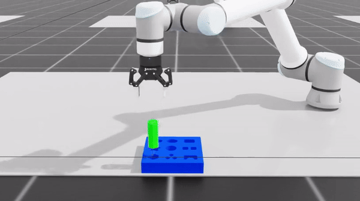

# Multi-arm assembly

This README walks through the process of 
1. Setting up a single or multi-arm reinforcement learning problem in isaaclab
2. Training a policy to solve the problem
3. Deploying to the actual robot through araas.

We will use the assets in `./taskboard/fmb_example` as our working example. We will try to insert the peg `./taskboard/fmb_example/Medium_Board_DarkBlue.obj` into the hole `./taskboard/fmb_example/Medium_Short_Hexagon_Green.obj`

## Dependencies

To use this package, you'll need two separate conda environments.
1. `araas` - Instructions found [here](https://pages.git.autodesk.com/mint/araas/)
2. `isaaclab` - Instructions found [here](https://isaac-sim.github.io/IsaacLab/source/setup/installation/pip_installation.html)
    ```
    conda create -n isaaclab python=3.10
    conda activate isaaclab
    pip install torch==2.2.2 --index-url https://download.pytorch.org/whl/cu118
    pip install isaacsim-rl isaacsim-replicator isaacsim-extscache-physics isaacsim-extscache-kit-sdk isaacsim-extscache-kit isaacsim-app --extra-index-url https://pypi.nvidia.com
    git clone git@github.com:isaac-sim/IsaacLab.git
    sudo apt install cmake build-essential
    ./isaaclab.sh --install # or "./isaaclab.sh -i"
    ```

Installing isaaclab will require setting up the Omniverse desktop application and installing IsaacSim through it.
Once you have these conda environments, install the multi_arm_assembly package on both. Simply run the following line from the root directory of this package in both environments

```bash
python -m pip install -e .
```

Some bug solutions for environment setup:

https://github.com/isaac-sim/IsaacLab/pull/1808/files, https://github.com/isaac-sim/IsaacLab/issues/516#issuecomment-2202190989

## Converting stl/obj assets to USD

One way to convert assets to USD is through the IsaacSim application. Follow these instructions:

1. start isaacsim from the omniverse portal
2. file > import > your .stl/.obj file
3. If you exported from fusion, you will need to make sure to scale down the model from mm to m. To do this, make sure the unitsResolve scaling and rotation are disabled by clicking the blue button to the right and scale all dimensions by 0.001.
4. To add collision behavior to your object add a collider to your object. Right click the object add > physics > collider. 
5. By default, the collider is convex, for more precise collider, navigate to the collider property of your object and select SDF
6. You can optionally add a color to the object to make it more visible in isaac by right clicking the object create > material > OmniSurfaceLite and changing the colors in your material to the desired object colors. Then add the material to your object by clicking on the mesh and updating the material property to your newly created one
7. If you want your object to move in the scene, you'll need to make it a rigid body. We want this for the Medium_Short_Hexagon_Green but not the Medium_Short_Hexagon_Green. Select the object add > physics > rigid body.
8. You can also optionally set friction of the object by right clicking on the object create > physics > physics material. Change the friction and add that material to the physics material property of your mesh. I set friction to zero and friction combine mode to min for the peg object in this example. This will make the friction between peg and hole zero.
9. Save your file. You may notice that isaac has autocreated a filename with a .usd suffix. DO NOT save it under that filename. Pick a new one and delete the autocreated one. For examples of the created USDs see `./taskboard/fmb_example/Medium_Board_DarkBlue_Updated.usd` and `./taskboard/fmb_example/Medium_Short_Hexagon_Green_Updated.usd`


## Creating a task config

To set up a peg in hole problem, you'll need to specify the starting and goal poses of the objects. This is done using the `TaskConfig` dataclass in `./multi_arm_assembly/utils.py`. The meaning of each field in this dataclass can be found in the inline comments on the class definition.

#### PEG_ASSET_NAME, HOLE_ASSET_NAME
Paths to the USD assets

#### PEG_TYPE, HOLE_TYPE
- `part` type is a single rigid body with no joints
- `articulated_part` type is a set of rigid bodies connected by joints
- `peripheral` is a single rigid body that doesn't move in the scene

#### PEG_ATTACHMENT_PRIM/HOLE_ATTACHMENT_PRIM
The prim path of the rigid body mesh. You can find this by looking at the hierarchy in isaacsim.
If the peg or the hole are not grasped, use `None`.

### PEG_T_TIP/HOLE_T_TIP
This is the grasp on the object. The way I usually identify this is by loading the grasped part/hole into isaac along with a usd named
`./taskboard/grasp_pointer.usd`. The red ball on the grasp pointer is the tool tip and the two rods represent the gripper fingers. Move the grasp pointer to the right pose and record it in `PEG_T_TIP` or `HOLE_T_TIP`.

### PEG_GOAL/HOLE_GOAL
This results in different behavior depending on if `relative_goal` is true or false. If relative goal is true (the default option), `HOLE_GOAL` isn't used. To find a good `PEG_GOAL` you can 
1. load the hole .usd into isaac
2. load the peg .usd into isaac
3. move and rotate the peg to be in the right relative position
4. click the colors on rotation to view the quaternion
5. record the  translation and quaternion into `PEG_GOAL`

### WORLD_T_PEG_START/WORLD_T_HOLE_START
These define the starting positions of the peg and hole. This is where starts executing from. Note: this is NOT where the object start out in the actual scene before being picked up. Typically you can just translate the goal pose a little to get the start pose.

### WORLD_T_TOOL_PICK_PEG/WORLD_T_TOOL_PICK_HOLE
These are ONLY used in araas. They have no effect on the RL training. They are used to specify where objects are picked up from in the real world. If none, then no object is picked before moving to `WORLD_T_PEG_START`/`WORLD_T_HOLE_START`.

## Training a policy
Make sure you change NUM_ENVS in `direct_isaac_lab_position.py` before you start training.
Sometimes 2000 envs at once will work, but sometimes you have to go as low as 1000.

```bash
python train_rl.py --task=AssemblyInsert-v0 --headless --enable_cameras --num_envs 1000
```

Enable visualization during training by reducing `NUM_ENVS` to 10 in `direct_isaac_lab_position.py`; otherwise, the training speed is too slow.
```bash
python train_rl.py --task=AssemblyInsert-v0
```

## Scripted Policy

For scripted policy such as `AssemblyMove-v0 (MoveToFixture)`, `AssemblyMove-v0 (MoveToBoard)`, `AssemblyScriptedGrasp-v0`, run

```bash
python train_rl.py --task=AssemblyMove-v0 --enable_cameras --num_envs 2 --play --video
```
Or
```bash
python train_rl.py --task=AssemblyScriptedGrasp-v0 --enable_cameras --num_envs 2 --play --video
python train_rl.py --task=BeamScriptedInsert-v0 --enable_cameras --num_envs 2
python train_rl.py --task=StoolInsert-v0 --headless --enable_cameras --num_envs 1000
```

## Visualizing a trained policy in isaac

First, decrease the number of envs to 10. Then run the following:

```bash
python train_rl.py --task=DirectPosition-v0 --play --checkpoint=<path-to-your-checkpoint>
```

Or record video
```bash
python train_rl.py --task=DirectPosition-v0 --play --checkpoint=<path-to-your-checkpoint> --video
```

Add `--num_envs 2` and `--enable_cameras`:
```bash
python train_rl.py --task=AssemblyInsert-v0 --play --enable_cameras --checkpoint /home/jiankai/Programs/long-horizon-assembly/packages/multi-robot-assembly/multi_arm_assembly/logs/rl_games/apa_impedance/2024-07-27_00-33-59/nn/last_apa_impedance_ep_1700_rew_-20.040802.pth --video --num_envs 2
python train_rl.py --task=StoolInsert-v0 --play --enable_cameras --checkpoint /home/jsun/Programs/long-horizon-assembly/packages/multi-robot-assembly/multi_arm_assembly/logs/rl_games/apa_impedance/2025-04-23_21-40-05/nn/last_apa_impedance_ep_1475_rew_-2.533575.pth --video --num_envs 2
```

Run multi-stage:
```bash
python pipeline_isaaclab.py --task=AssemblyInsert-v0 --play --enable_cameras --num_envs 2 --video
```

## Domain Randomization

The setup for domain randomization is pretty informal right now. Currently, I just add gaussian noise to the attachment offset with the following line in the `update_rigid_attachment` function:

```python
translation_offset = (torch.rand(NUM_ENVS,3).type(torch.FloatTensor).cuda()-0.5)*0.01
```

This is subject to change soon.

## Running on the robot
To run on the robot, you'll need 4 separate windows open. I have this setup automatically in tmux by running `sh tmux_setup.sh` from the root directory. It prepopulates each pane with the desired command.  
1. The bottom left and bottom right panes control the grippers and should be run first. 
2. The middle pane is the pyaraas server and should be run second. 
3. The top pane is the RL policy that you'll need to fill in with your custom checkpoint.
```bash
python run_rl_araas_assembly.py
```
If you run araas without `--enable-hardware` you can see it execute in pyaraas without actually testing on hardware.

## Result


